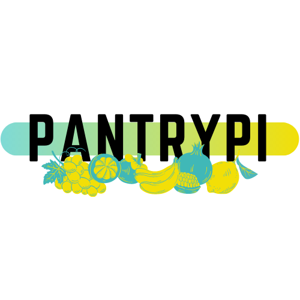

<!--
*** Thanks for checking out the Best-README-Template. If you have a suggestion
*** that would make this better, please fork the repo and create a pull request
*** or simply open an issue with the tag "enhancement".
*** Thanks again! Now go create something AMAZING! :D
***
***
***
*** To avoid retyping too much info. Do a search and replace for the following:
*** github_username, repo_name, twitter_handle, email, project_title, project_description
-->

<!-- PROJECT LOGO -->
<br />
<p align="center">
  <a href="https://github.com/github_username/repo_name">
    
  </a>

  <h3 align="center">PantryPi</h3>

  <p align="center">
    PantryPi allows me to view the food products in my pantry! I was tired of getting to the grocery store and realizing I forgot to check if we had x at home, so I'm building out a full-stack app for my specific pantry.
  </p>
</p>

### Built With

* [Python 3.8](https://www.python.org/downloads/)

<!-- GETTING STARTED -->
## Getting Started

To get a local copy up and running follow these steps:

### Prerequisites

* A 12 digit barcode
* An API & App key for [Edamam's Food DB API](https://developer.edamam.com/food-database-api)
* [Python 3.8](https://www.python.org/downloads/)
* Pip
* Pipenv

### Installation

1. Clone the repo
    ```sh
   git clone https://github.com/MissPeperr/PantryPi-Server.git
   ```
1. Install packages through pipenv
   ```sh
   pipenv install
   ```
1. Start virtual environment
    ```sh
    pipenv shell
    ```
1. Create a `key.py` file in the root directory of the project and store the API and App keys:
    ```py
    app_id="app_id from edamam"
    api_key="api_key from edamam"
    ```
1. Create a `pantry.db` file in the root directory of the project
1. Execute the SQL in `pantry.sql` with your preferred method to create some starter data (I'm using a vscode extension [SQLTools](https://marketplace.visualstudio.com/items?itemName=mtxr.sqltools))
1. Run server with:
    ```sh
    watchgod request_handler.main
    ```

### Client
Once you complete the steps above, feel free to check out the client app as well.

[PantryPi Client](https://github.com/MissPeperr/PantryPi-Client)

## Endpoints Currently Supported
- GET all food
  ```
  /food
  ```
- GET food by a 12 digit barcode
  ```
  /food?barcode=044000032029
  ```
- DELETE food by barcode
  ```
  /food?barcode=044000032029
  ```